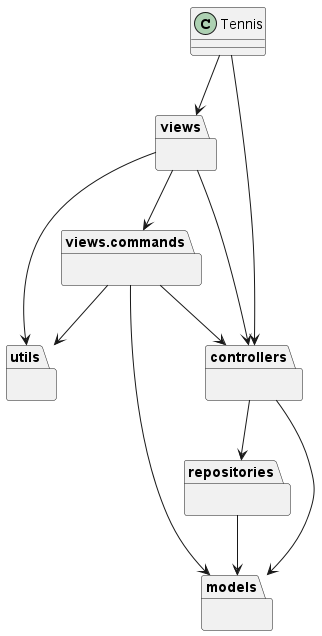
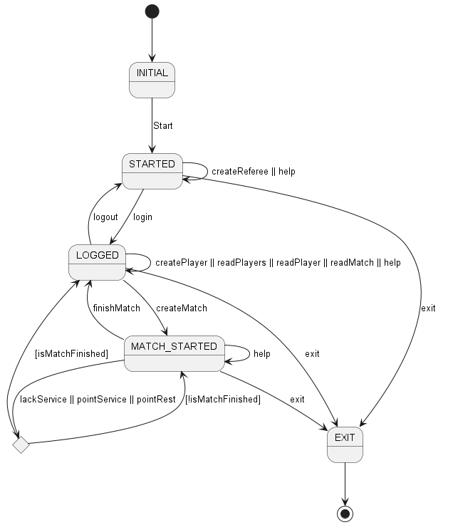
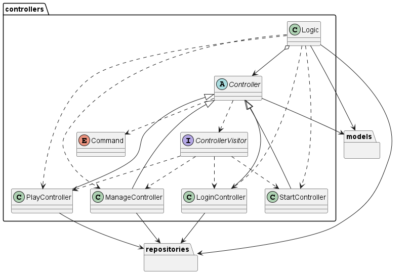
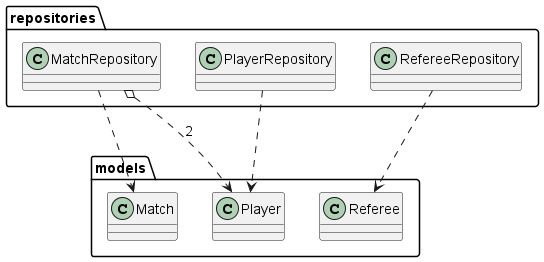
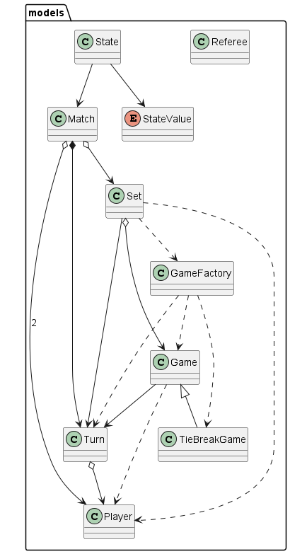
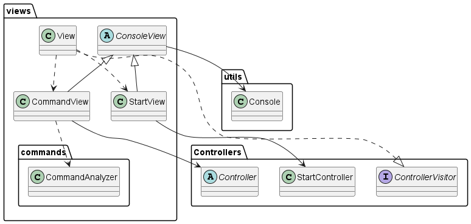
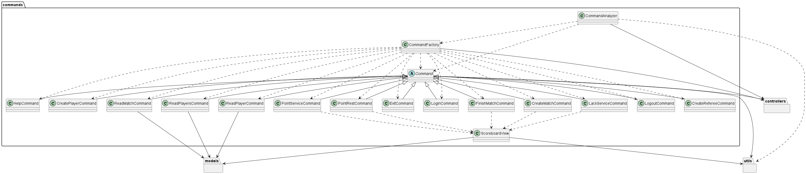
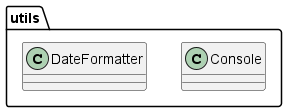

# Tennis manager

Práctica del [Curso de Diseño de Software](https://escuela.it/cursos/curso-diseno-software) de [Escuela IT](https://escuela.it) 

### Diagrama de paquetes

### Diagrama de estados

### Diagrama de clases del paquete controllers

### Diagrama de clases del paquete repositories

### Diagrama de clases del paquete models

### Diagrama de clases del paquete views

### Diagrama de clases del paquete views.commands

### Diagrama de clases del paquete utils

